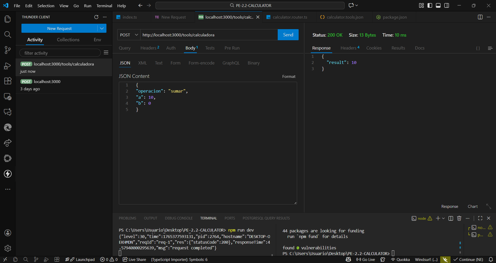

# PE-2.2 CALCULATOR – API MCP

API REST desarrollada con **Fastify + TypeScript**, diseñada para procesar operaciones aritméticas basicas (suma, resta, multiplicacion y division).
El proyecto integra **Swagger** para documentar la API, emplea **JSON Schema** para validar los datos de entrada y utiliza una arquitectura modular siguiendo buenas practicas de desarrollo.

---

## **Estructura del Proyecto**

El proyecto esta organizado de forma clara y modular:

PE-2.2-CALCULATOR/
│
├── capturas/                  # Evidencias y pruebas (opcional)
├── node_modules/              # Dependencias del entorno
│
├── src/
│   ├── routes/
│   │   └── calculator.router.ts     # Control de la operacion calculadora
│   │
│   ├── tools/
│   │   └── calculator.tools.json    # Esquema de validacion de entrada
│   │
│   └── index.ts                     # Servidor, configuracion y Swagger
│
├── package.json
├── package-lock.json
└── tsconfig.json

# Descripcion General

La API expone un endpoint principal utilizado para resolver operaciones matematicas basicas:

POST /tools/calculadora

El flujo general de funcionamiento es el siguiente:

1. El usuario envia un cuerpo JSON que incluye la operacion a realizar y dos valores numéricos.
2. Los datos pasan por un sistema de validacion definido en un archivo JSON.
3. Según la operacion solicitada, el sistema ejecuta el calculo.
4. Se devuelve un resultado exitoso o un mensaje de error si la peticion es invalida.

La API esta diseñada para operar de forma segura, validada y documentada.

---

# Principales Funcionalidades

Permite ejecutar **cuatro operaciones aritméticas**:

* Suma
* Resta
* Multiplicacion
* Division

- Validacion estricta del JSON recibido mediante un esquema formal.
- Documentacion automatica accesible desde **/docs** gracias a Swagger UI.
- Manejo robusto de errores, incluyendo division entre cero.
- Arquitectura modular que separa rutas, herramientas y configuracion principal.
- Implementada completamente con **TypeScript** para mejorar la calidad del codigo.

---

# Instalacion del Proyecto

Para instalar las dependencias del entorno se utiliza:

npm install

---

#  Ejecucion del Servidor

Para iniciar el servidor en modo desarrollo:
npm run dev

Una vez levantado, el servidor estara disponible en:
http://localhost:3000

---

# Documentacion Swagger

La documentacion interactiva generada automaticamente esta disponible en:
http://localhost:3000/docs

Aqui podras:

* Ver como funciona el endpoint
* Revisar los parametros requeridos
* Probar la API desde el navegador
* Consultar las respuestas posibles

---

# Funcionamiento del Endpoint

El endpoint de la calculadora:

* **Recibe** un objeto JSON con la operacion a realizar y los valores numéricos.
* **Valida** que la operacion sea una de las permitidas y que los números sean validos.
* **Ejecuta** la operacion correspondiente.
* **Responde** con el resultado o con un mensaje de error si los datos no cumplen el esquema.

La validacion evita entradas incorrectas, propiedades adicionales y operaciones invalidas.

---

# Pruebas Realizadas (Thunder Client)

Se realizaron pruebas con los siguientes escenarios:

### Suma

Entrada valida → retorna el resultado correcto.

### Resta

Entrada valida → devuelve el resultado esperado.

### Multiplicacion

Entrada valida → operacion correcta.

### Division

Entrada valida → resultado calculado correctamente.

### Division entre cero

La API responde con un **error 400** indicando que la operacion no es valida.

### Validacion de esquema

Si el usuario envia datos incorrectos, faltantes o con propiedades extra, la API los rechaza de forma segura.

---

# Resultado Final del Proyecto

Esta API cumple con los requisitos del MCP:

* Arquitectura limpia y estructurada
* Operaciones matematicas totalmente funcionales
* Manejo seguro y validado de entrada
* Documentacion clara con Swagger
* Buenas practicas de desarrollo con TypeScript y Fastify

Es una solucion lista para ser integrada o ampliada.

## 🔐 Seguridad y Autenticación

Aunque la autenticación no está implementada en esta versión,
la documentación OpenAPI incluye esquemas de seguridad con el
objetivo de mostrar buenas prácticas de diseño de APIs.

### Esquemas documentados:
- **API Key**: Uso de una clave enviada en el header `X-API-KEY`
- **Bearer Token (JWT)**: Autenticación basada en tokens JWT

Estos mecanismos permitirían proteger los endpoints
en un entorno productivo.

### Mitigación de Tool Poisoning
Para prevenir ataques de Tool Poisoning, el API documenta
la validación estricta de entradas, control de acceso y
limitación de solicitudes automatizadas no autorizadas.
Estas medidas reducen el riesgo de manipulación maliciosa de herramientas
y fortalecen la confiabilidad del servicio.

## 📦 Versionado del API

El MCP Calculator Tool utiliza versionado semántico (SemVer):

- **MAJOR**: Cambios incompatibles
- **MINOR**: Nuevas funcionalidades compatibles
- **PATCH**: Correcciones y mejoras internas

Ejemplo:
- `1.0.0` → Versión inicial
- `1.1.0` → Nueva operación matemática
- `2.0.0` → Cambio en estructura de respuestas

La estrategia de versionado por URL (`/api/v1`) permite
mantener compatibilidad con clientes existentes.
Esta estrategia permite evolucionar el API sin afectar a los clientes existentes,
facilitando la compatibilidad hacia atrás y el mantenimiento del servicio a largo plazo.

# Autor

**Jhandry Jaramillo**
Practica PE-2.2 – MCP
Universidad Internacional del Ecuador (UIDE)
